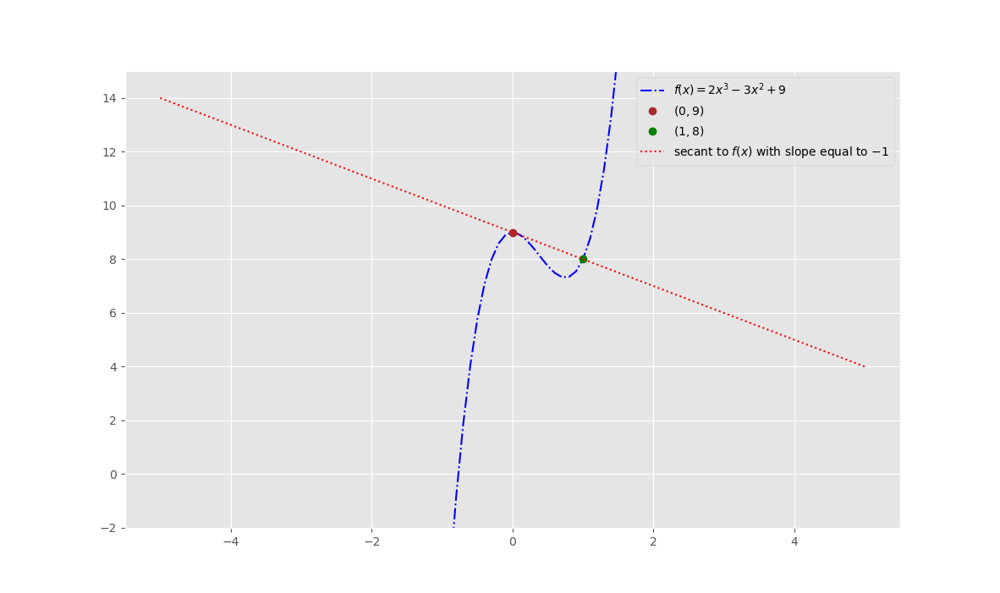

# Indiana Bloomington Data Science Essential Courses
## A repo with my work on exercises in this curriculum.
#### It includes work with **5** languages:
- **C++**
- **Java**
- **R**
- **RMarkdown**
- **Python**
#### Also work in **mySQL** and **MongoDB**, as well as **Linear Algebra & Calculus**.
#### Using a variety of Development Environments, including:
- **RStudio**
- **Jupyter Notebooks**
- **Eclipse IDE for Java**
- **Pycharm**

